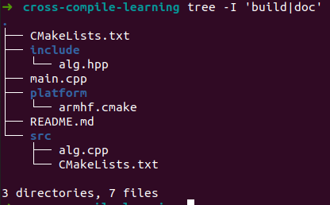
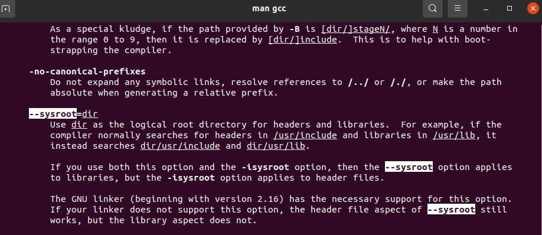
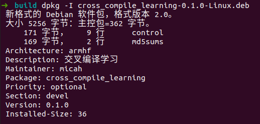
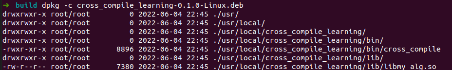
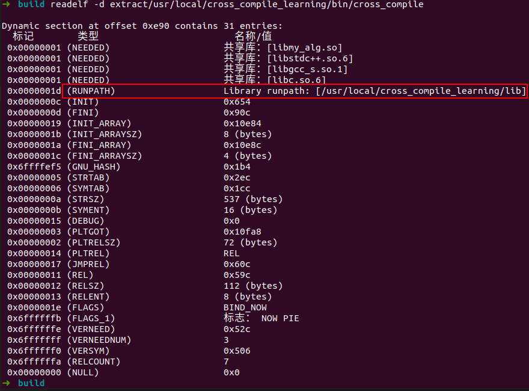
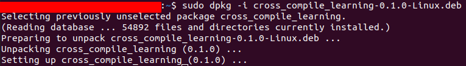

<!-- @import "[TOC]" {cmd="toc" depthFrom=1 depthTo=6 orderedList=false} -->

<!-- code_chunk_output -->

- [CMake 交叉编译学习](#cmake-交叉编译学习)
  - [一、交叉编译环境搭建](#一交叉编译环境搭建)
  - [二、交叉编译 Simple Example](#二交叉编译-simple-example)
    - [1. 目录结构](#1-目录结构)
    - [2. 顶层CMakeLists.txt](#2-顶层cmakeliststxt)
    - [3. src/CMakeLists.txt](#3-srccmakeliststxt)
    - [4. platform/armhf.cmake](#4-platformarmhfcmake)
    - [5. 交叉编译指令](#5-交叉编译指令)
    - [6. deb包查看和安装](#6-deb包查看和安装)

<!-- /code_chunk_output -->


# CMake 交叉编译学习

## 一、交叉编译环境搭建

1. 编译主机系统：`Ubunbtu 20.04 LTS`
2. 确定硬件架构名称：`uname -m`
3. 下载对应编译器，可通过以下命令下载

```
1. uname -m 为 armv7l
sudo apt install gcc-9-arm-linux-gnueabihf g++-9-arm-linux-gnueabihf

2. uname -m 为 aarch64
sudo apt install gcc-9-aarch64-linux-gnu g++-9-aarch64-linux-gnu

```
> 注：如果系统版本低于Ubunbtu 20.04，如18.04，apt gcc交叉编译器最高版本为gcc-8

## 二、交叉编译 Simple Example

main.cpp 链接动态库，生成可执行文件（目标机器为armv7l）

### 1. 目录结构



### 2. 顶层CMakeLists.txt

编译并打包成`.deb`包

```cmake
cmake_minimum_required(VERSION 3.15)
project(cross_compile_learning
        VERSION 0.1.0
        DESCRIPTION 交叉编译学习)

set(CMAKE_CXX_STANDARD 17)
add_compile_options(-fPIC -Wall -Wextra -Wno-psabi)

message("CMAKE_TOOLCHAIN_FILE: ${CMAKE_TOOLCHAIN_FILE}")

set(DEFAULT_RUNPATH ${CMAKE_INSTALL_PREFIX}/lib)

add_subdirectory(src)

add_executable(cross_compile main.cpp)
target_link_libraries(cross_compile my_alg)
target_link_directories(cross_compile PUBLIC src)
target_include_directories(cross_compile PUBLIC ${CMAKE_SOURCE_DIR}/include)
set_target_properties(cross_compile PROPERTIES INSTALL_RPATH ${DEFAULT_RUNPATH})

install(
    TARGETS cross_compile my_alg
    RUNTIME DESTINATION bin
    LIBRARY DESTINATION lib
    ARCHIVE DESTINATION lib
    PUBLIC_HEADER DESTINATION include
)

set(CPACK_PACKAGING_INSTALL_PREFIX ${CMAKE_INSTALL_PREFIX})
set(CPACK_GENERATOR "DEB")
set(CPACK_DEBIAN_PACKAGE_ARCHITECTURE "armhf")
set(CPACK_DEBIAN_PACKAGE_MAINTAINER "micah")
include(CPack)

```
- cmake文档地址：
  - 指令文档地址：`https://cmake.org/cmake/help/latest/command/` + `{command}` + `.html`
  - 变量文档地址：`https://cmake.org/cmake/help/latest/variable/` + `{VARIABLE}` + `.html`
- `set_target_properties(cross_compile PROPERTIES INSTALL_RPATH ${DEFAULT_RUNPATH})` 
  - 设置安装后，程序运行时库搜索路径
  - 参考：https://cmake.org/cmake/help/latest/command/set_target_properties.html
- `install(...)` 
  - `TARGETS cross_compile my_alg` 安装`cross_compile`, `my_alg`
  - `RUNTIME DESTINATION bin` 将依赖的可执行文件放到安装目录下的`bin`文件夹中（默认），可更改放到其他文件夹中
  - `LIBRARY DESTINATION lib` 将依赖的`.so`动态库文件放到安装目录下的`lib`文件夹中（默认），可更改放到其他文件夹中
  - `ARCHIVE DESTINATION lib` 将依赖的`.a`静态库文件放到安装目录下的`lib`文件夹中（默认），可更改放到其他文件夹中
  - 对于`Windows`, `MacOS`系统，`RUNTIME`, `LIBRARY`, `ARCHIVE`有其他含义，具体参考：https://cmake.org/cmake/help/latest/command/install.html
- `set(CPACK_PACKAGING_INSTALL_PREFIX ${CMAKE_INSTALL_PREFIX})` 设置安装目录，同时会用`CMAKE_INSTALL_RPATH`替换`CMAKE_BUILD_RPATH`
- `set(CPACK_GENERATOR "DEB")` 设置打包为`.deb`包
- `set(CPACK_DEBIAN_PACKAGE_ARCHITECTURE "armhf")` 设置目标架构，不设置默认为`dpkg --print-architecture`结果
- `set(CPACK_DEBIAN_PACKAGE_MAINTAINER "micah")` 设置包管理者，不设置默认为`CPACK_PACKAGE_CONTACT`
- 参考：[CPack](https://cmake.org/cmake/help/latest/module/CPack.html)，[CPack DEB Generator](https://cmake.org/cmake/help/latest/cpack_gen/deb.html)

### 3. src/CMakeLists.txt


```cmake
add_library(my_alg SHARED alg.cpp)
```

### 4. platform/armhf.cmake

```cmake
set(CMAKE_SYSTEM_NAME Linux)
set(CMAKE_SYSTEM_PROCESSOR arm)

# set(CMAKE_SYSROOT /path/to/sys-rootfs)

set(CMAKE_C_COMPILER arm-linux-gnueabihf-gcc-9)
set(CMAKE_CXX_COMPILER arm-linux-gnueabihf-g++-9)

set(CMAKE_FIND_ROOT_PATH_MODE_PROGRAM NEVER)
set(CMAKE_FIND_ROOT_PATH_MODE_LIBRARY ONLY)
set(CMAKE_FIND_ROOT_PATH_MODE_INCLUDE ONLY)
set(CMAKE_FIND_ROOT_PATH_MODE_PACKAGE ONLY)
```

- 交叉编译参考：[cmake-toolchains](https://cmake.org/cmake/help/latest/manual/cmake-toolchains.7.html)
- `CMAKE_SYSTEM_NAME` 设置要构建的目标平台的 CMake 标识符
- `CMAKE_SYSTEM_PROCESSOR` 设置要构建的目标架构的 CMake 标识符
- `CMAKE_SYSROOT` 可选，传递`--sysroot=dir`，即修改库和头文件搜索路径，头文件搜索路径由原来的`/usr/include`变为`dir/usr/include`，库搜索路径由原来的`/usr/lib`变为`dir/usr/lib`

- `CMAKE_FIND_ROOT_PATH_MODE_PACKAGE`
  - 控制`find_package`指令搜索路径方式，`ONLY`表示仅在`CMAKE_FIND_ROOT_PATH`中搜索，不在主机系统路径搜索
  - 参考：[CMAKE_FIND_ROOT_PATH_MODE_PACKAGE](https://cmake.org/cmake/help/latest/variable/CMAKE_FIND_ROOT_PATH_MODE_PACKAGE.html)，[find_package](https://cmake.org/cmake/help/latest/command/find_package.html)

### 5. 交叉编译指令

```shell
rm -rf build
mkdir build
cd build
cmake -DCMAKE_TOOLCHAIN_FILE=../platform/armhf.cmake -DCMAKE_INSTALL_PREFIX=/usr/local/cross_compile_learning  ..
make -j4
cpack
```

### 6. deb包查看和安装

- 查看包信息



- 查看包目录结构



- 解压包到extract目录

```shell
dpkg -x cross_compile_learning-0.1.0-Linux.deb extract
```

- 打印可执行文件`dynamic section`内容



- 安装



- 运行

```shell
/usr/local/cross_compile_learning/bin/cross_compile
```